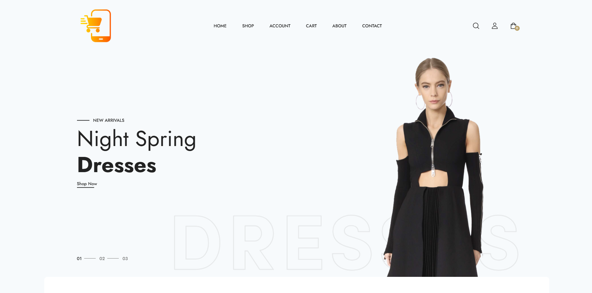
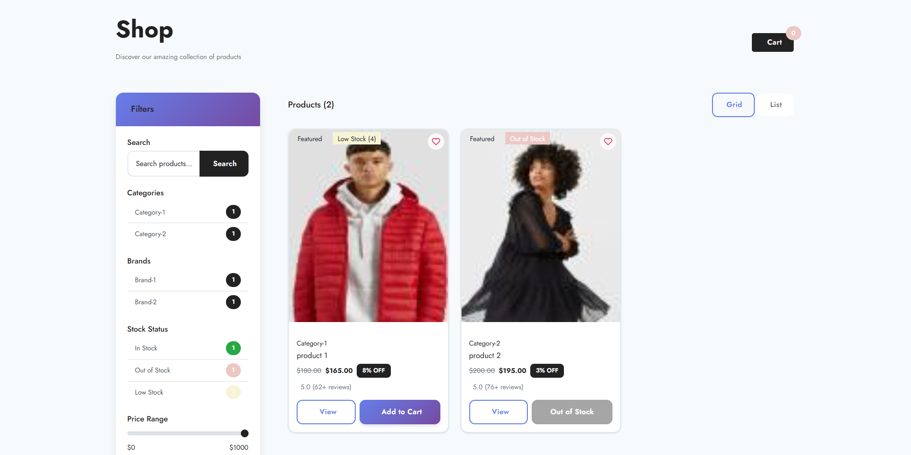
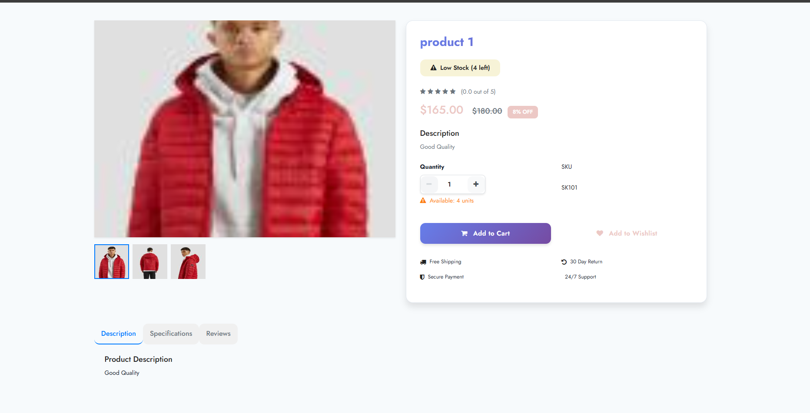
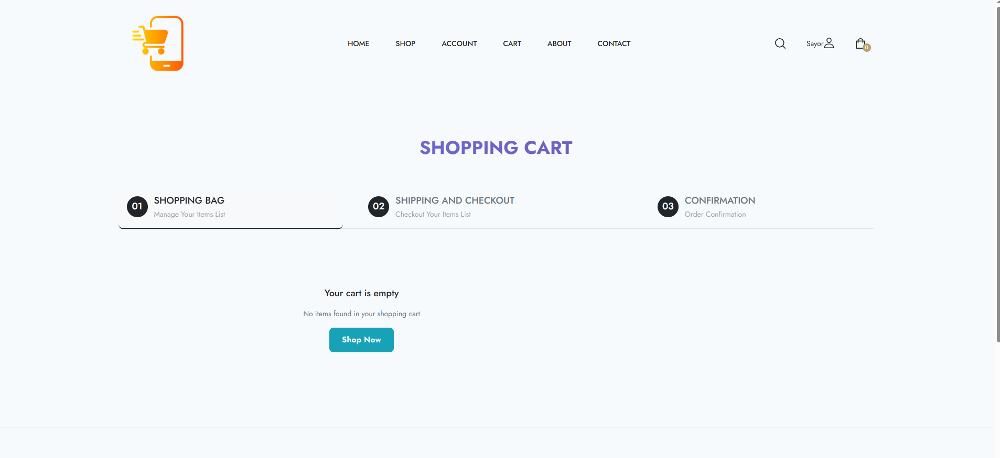
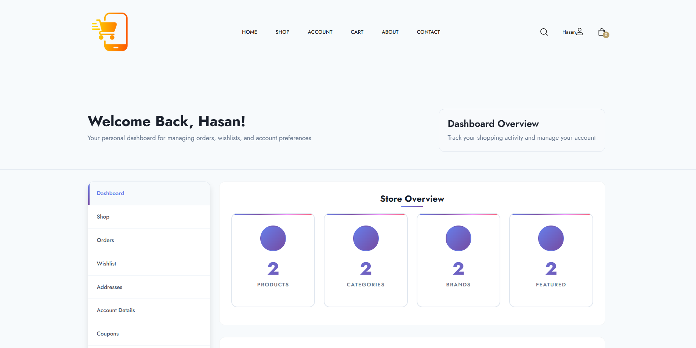
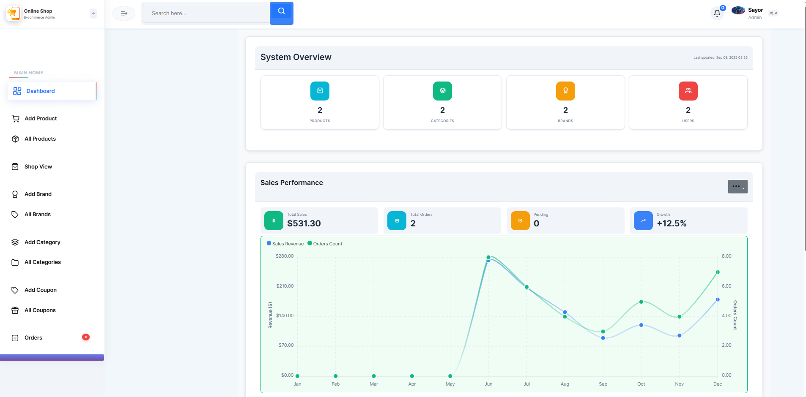
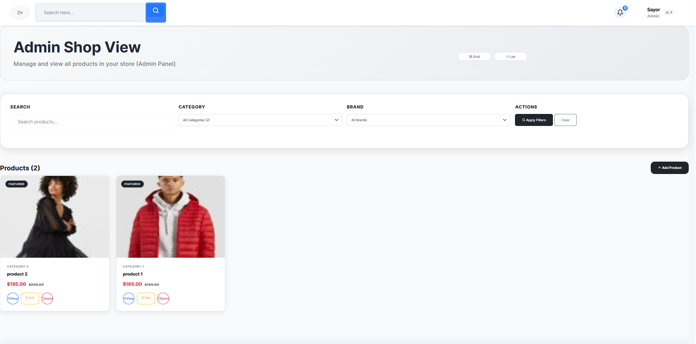

# 🛍️ OnlineShop - Premium E-Commerce Platform

<div align="center">


*A modern, feature-rich e-commerce platform built with Laravel featuring beautiful UI/UX, advanced animations, and comprehensive admin management.*

[🚀 Live Demo](#-installation--setup) • [📱 Features](#-features) • [🛠️ Tech Stack](#-tech-stack) • [📸 Screenshots](#-screenshots)

</div>

---

## ✨ Features

### 🎨 **Beautiful User Interface**
- **Modern Design System** with gradient themes and smooth animations
- **Responsive Layout** that works perfectly on all devices
- **Professional Animations** including hover effects, loading states, and scroll animations
- **Custom CSS Variables** for consistent theming throughout the application

### 🛒 **Complete E-Commerce Functionality**
- **Product Catalog** with advanced filtering (category, brand, price, search)
- **Shopping Cart** with real-time updates and quantity management
- **Wishlist System** for saving favorite products
- **Order Management** with complete order lifecycle tracking
- **Coupon System** with discount codes and usage tracking
- **Product Reviews & Ratings** system

### 👥 **User Management**
- **Dual User Roles** - Customers and Administrators
- **Secure Authentication** with Laravel's built-in auth system
- **User Profiles** with address management
- **Order History** and tracking for customers

### 🔧 **Admin Panel**
- **Dashboard Analytics** with sales statistics and charts
- **Product Management** - Add, edit, delete products with image galleries
- **Category & Brand Management** with image uploads
- **Order Processing** - View, update status, and manage orders
- **User Management** - View and manage customer accounts
- **Coupon Management** - Create and manage discount codes
- **Notification System** for order updates

### 🎯 **Advanced Features**
- **Image Gallery System** with thumbnail generation
- **Stock Management** with low stock alerts
- **Email Notifications** for order confirmations
- **PDF Invoice Generation** for orders
- **Search Functionality** across products
- **Pagination** for better performance
- **Session-based Cart** with persistent storage

## 🛠️ Tech Stack

### **Backend**
- **Laravel 10.x** - PHP Framework
- **MySQL 8.0+** - Database
- **Eloquent ORM** - Database management
- **Laravel Blade** - Templating engine

### **Frontend**
- **Bootstrap 5.3** - CSS Framework
- **Custom CSS** - Advanced styling with CSS variables
- **JavaScript (ES6+)** - Interactive features
- **Font Awesome** - Icons
- **Swiper.js** - Image carousels

### **Additional Libraries**
- **SweetAlert2** - Beautiful alert dialogs
- **jQuery** - DOM manipulation
- **Laravel Mix** - Asset compilation

---

## 📸 Screenshots

### 🏠 **Homepage**
<div align="center">
  
  <p><em>Beautiful hero section with animated slideshow, product categories showcase, and featured products grid</em></p>
</div>

### 🛍️ **Shop & Product Pages**
<div align="center">
  
  <p><em>Advanced product filtering, search functionality, and product grid layout</em></p>
</div>

<div align="center">
  
  <p><em>Product detail page with image gallery, reviews, and add to cart functionality</em></p>
</div>

### 🛒 **Shopping Cart**
<div align="center">
  
  <p><em>Shopping cart with real-time updates, quantity management, and checkout process</em></p>
</div>

### 👤 **User Dashboard**
<div align="center">
  
  <p><em>Order history, address management, and account settings</em></p>
</div>

### ⚙️ **Admin Panel**
<div align="center">
  
  <p><em>Comprehensive dashboard with analytics, sales statistics, and management tools</em></p>
</div>

<div align="center">
  
  <p><em>Product management interface with add, edit, and delete functionality</em></p>
</div>

## 🚀 Installation & Setup

### **Prerequisites**
- PHP 8.1 or higher
- Composer
- MySQL 8.0 or higher
- Node.js & NPM (for asset compilation)

### **Quick Start**

1. **Clone the repository**
   ```bash
   git clone https://github.com/yourusername/onlineshop.git
   cd onlineshop
   ```

2. **Install dependencies**
   ```bash
   composer install
   npm install
   ```

3. **Environment setup**
   ```bash
   cp .env.example .env
   php artisan key:generate
   ```

4. **Database configuration**
   ```bash
   # Update .env file with your database credentials
   DB_CONNECTION=mysql
   DB_HOST=127.0.0.1
   DB_PORT=3306
   DB_DATABASE=onlineshop
   DB_USERNAME=your_username
   DB_PASSWORD=your_password
   ```

5. **Run migrations and seed data**
   ```bash
   php artisan migrate --seed
   ```

6. **Compile assets**
   ```bash
   npm run dev
   ```

7. **Start the development server**
   ```bash
   php artisan serve
   ```

8. **Visit the application**
   ```
   http://127.0.0.1:8000
   ```

### **Demo Accounts**

**Customer Account:**
- Email: `test@example.com`
- Password: `password`

**Admin Account:**
- Email: `admin@example.com`
- Password: `password`

---

## 🎯 Key Features Showcase

### **🎨 Design Excellence**
- **Gradient Themes** - Beautiful purple gradient design system
- **Smooth Animations** - Hover effects, loading states, and scroll animations
- **Professional Typography** - Consistent font hierarchy and spacing
- **Responsive Design** - Perfect on desktop, tablet, and mobile

### **🛒 E-Commerce Features**
- **Advanced Product Filtering** - By category, brand, price range
- **Real-time Search** - Instant product search with suggestions
- **Shopping Cart** - Session-based cart with persistent storage
- **Order Management** - Complete order lifecycle from cart to delivery

### **👨‍💼 Admin Capabilities**
- **Analytics Dashboard** - Sales statistics and performance metrics
- **Inventory Management** - Stock tracking with low stock alerts
- **Order Processing** - Status updates and customer notifications
- **Content Management** - Products, categories, and brand management

---

## 🎓 Learning Outcomes

This project demonstrates proficiency in:

- **Laravel Framework** - Advanced Laravel features and best practices
- **Database Design** - Complex relationships and migrations
- **Frontend Development** - Modern CSS, JavaScript, and responsive design
- **E-Commerce Logic** - Shopping cart, orders, payments, and inventory
- **User Experience** - Intuitive navigation and professional design
- **Project Management** - Organized code structure and documentation

---

## 🚀 Future Enhancements

- [ ] **Payment Gateway Integration** (Stripe, PayPal)
- [ ] **Real-time Chat Support** for customer service
- [ ] **Advanced Analytics** with charts and reports
- [ ] **Multi-language Support** for international markets
- [ ] **Mobile App** using Laravel API
- [ ] **Advanced Search** with filters and sorting
- [ ] **Email Marketing** integration
- [ ] **Inventory Alerts** and automated reordering

---

## 📁 Project Structure

```
onlineshop/
├── app/
│   ├── Http/Controllers/     # Application controllers
│   ├── Models/              # Eloquent models
│   ├── Services/            # Business logic services
│   └── Notifications/       # Email notifications
├── database/
│   ├── migrations/          # Database schema
│   └── seeders/            # Sample data
├── resources/
│   ├── views/              # Blade templates
│   ├── css/                # Custom stylesheets
│   └── js/                 # JavaScript files
├── public/
│   ├── assets/             # Static assets
│   └── uploads/            # User uploaded files
└── routes/                 # Application routes
```

---

## 🤝 Contributing

Contributions are welcome! Please feel free to submit a Pull Request. For major changes, please open an issue first to discuss what you would like to change.

1. Fork the project
2. Create your feature branch (`git checkout -b feature/AmazingFeature`)
3. Commit your changes (`git commit -m 'Add some AmazingFeature'`)
4. Push to the branch (`git push origin feature/AmazingFeature`)
5. Open a Pull Request

---

## 📄 License

This project is licensed under the MIT License - see the [LICENSE](LICENSE) file for details.

---

## 👨‍💻 Author

**Your Name**
- GitHub: [@SayorHasan](https://github.com/SayorHasan)
- LinkedIn: [N/A](https://linkedin.com/in/yourprofile)
- Email: sayorhasan1@gmail.com

---

<div align="center">

**⭐ If you found this project helpful, please give it a star! ⭐**

Made with ❤️ and Laravel

</div>
